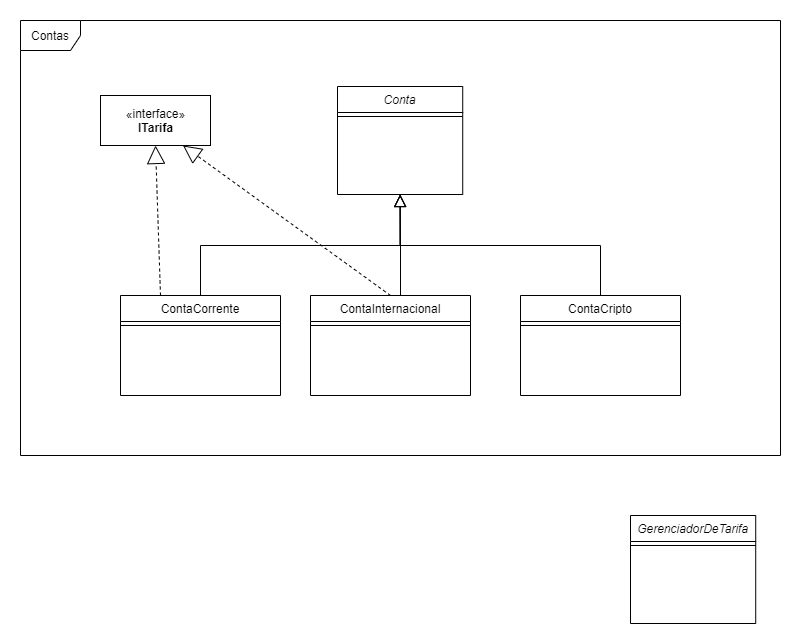

# Teste de Performance 3
## Exercício #5

Implemente um programa no qual o usuário controle um sistema de tarifas bancárias para cálculo da tarifa mensal de um cliente. O sistema de tarifa deve obter do usuário os dados financeiros de cada produto do cliente no banco. Após, o sistema deve ser capaz de calcular e exibir a tarifa total que o cliente deve pagar. Siga os requisitos abaixo:

### Requisitos:
1. O banco oferece apenas três tipos de produto (conta corrente, conta internacional e conta cripto);
2. Obtenha do usuário o saldo de conta corrente (em reais), se o cliente possuir esse produto;
3. Obtenha do usuário o saldo de conta internacional (em dólar), se o cliente possuir esse produto;
4. Obtenha do usuário o saldo de conta cripto (em dólar), se o cliente possuir esse produto;
5. O saldo em conta corrente e conta internacional devem ser tarifados em 1,5% e 2.5% respectivamente;
6. O saldo em conta cripto não é tarifado;
7. Calcule o valor do saldo atual de forma cumulativa para cada tipo de conta (em real) informado pelo usuário;
8. Calcule o valor da tarifa de forma cumulativa para cada tipo de conta informado pelo usuário;
9. Exiba o valor total da tarifa e do total do saldo atual em reais (de todos os produtos informados);
10. Ofereça duas opções: realizar novo cálculo ou sair do programa;

### Requisitos técnicos:
1. Crie a classe base Conta de forma abstrata. Crie uma propriedade para conter o valor do saldo atual (em reais) e marque-a como virtual. Encapsule a propriedade de modo adequado. Crie um construtor parametrizado, inicializando o valor do saldo atual (em reais);
2. Crie a interface ITarifa com a assinatura do método Calcular, onde o retorno do método seja o valor da tarifa;
3. Crie classes para representar conta corrente, conta internacional e conta cripto, todas herdando da classe base Conta. 
4. As classes que representam conta corrente e conta internacional devem implementar a interface ITarifa. Implemente o método Calcular nas duas classes de acordo com as regras de negócio.
5. As classes que representam conta internacional e conta cripto devem sobrescrever a propriedade que representa o valor do saldo atual em reais, convertendo o valor recebido em dolar para real (defina uma taxa de câmbio aleatória de conversão).
6. Crie uma classe para representar o sistema de tarifas. Defina duas propriedades: uma para armazenar o valor total do saldo e outra para o valor total da tarifa. Encapsule as propriedades de modo apropriado. Para esta classe não é necessário criar construtor.
7. Ainda na classe que representa o sistema de tarifas (item anterior), crie um método que receba um único parâmetro do tipo Conta (classe abstrata - item 1). O retorno do método deve ser void. Este método deve acumular o valor da tarifa e o valor do saldo.
8. Implemente no programa principal um fluxo de repetição, condicional para instanciar o tipo da conta, de acordo com o desejo do usuário;
9. Utilize a classe Console apenas no programa principal;
10. Ademais, para o restante do programa, use os recursos da linguagem C# de acordo com os princípios da orientação a objetos e das boas práticas de código limpo.

### Diagrama de classes:

